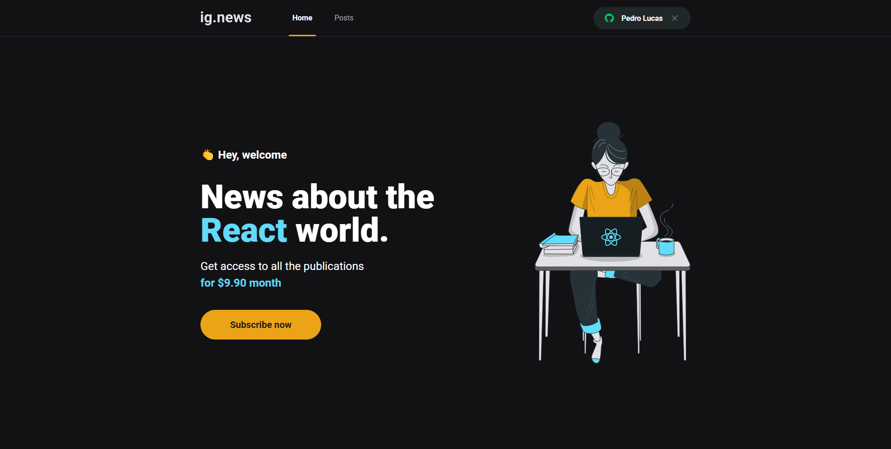
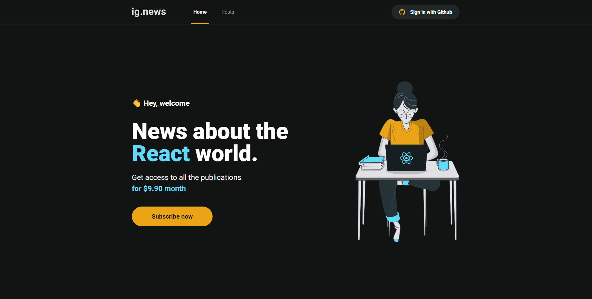

# <h1 align="center">IgNews</h1>

# Sobre

Aplicação construída no bootcamp Ignite da <a href="https://rocketseat.com.br/">Rocketseat</a>

    Aplicação de newsletter, usuário pode fazer login com seu github. Quando estiver logado ele pode ver
    o preview dos posts, caso queira ver completo ele assina a newsletter. A funcionalidade de pagamento
    foi feita usando <a href="https://stripe.com/br">Stripe</a>, para banco de dados foi
    usado <a href="https://fauna.com/">FaunaDB</a> e para criação de posts foi utilizado o CMS
    <a href="https://prismic.io/">Prismic</a>.

# Funcionalidades

Login com github

Com assinatura feita

# 🚀 Tecnologias

<ul>
    <li>ReactJS</li>
    <li>NextJS</li>
    <li>TypeScript</li>
    <li>FaunaDB</li>
    <li>Stripe</li>
    <li>Prismic</li>
    <li>Sass</li>
    <li>Axios</li>
    <li>react-icons</li>
</ul>

# Instalação

<strong>
    Necessário ter o <a href="https://nodejs.org/en/">Node.js</a> instalado,
    um instalador de pacotes: <a href="https://www.npmjs.com/">Npm</a> ou <a href="https://yarnpkg.com/">Yarn</a>,
    para clonar o repositório use o <a href="https://git-scm.com/">Git</a>
</strong>

<pre>
# Clone o repositório
git clone https://github.com/pdrolucasz/ig.news.git

# Na sua linha de comando navegue até a pasta
cd ig.news

# Instale as dependências
yarn ou npm install

# Defina as variáveis de ambiente
cp .env.example .env

# Inicie a aplicação
yarn dev ou npm run dev
</pre>

#

<h3 align="center">Made with 💜 by <a href="https://github.com/pdrolucasz">Pedro Lucas</a></h3>
